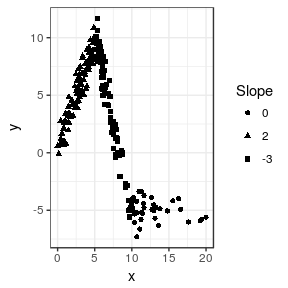
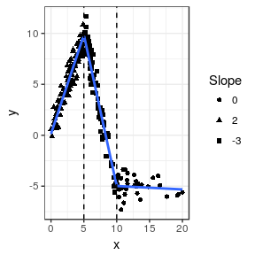
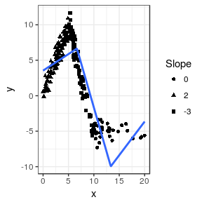
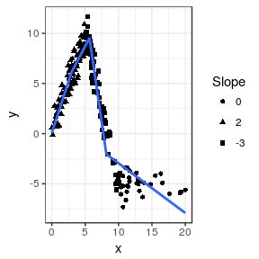

lspline: Linear Splines with Convinient Parametrizations
================

-   [Examples](#examples)
    -   [Setting knot locations manually](#setting-knot-locations-manually)
    -   [Knots at `n` equal-length intervals](#knots-at-n-equal-length-intervals)
    -   [Knots at `q`uantiles of `x`](#knots-at-quantiles-of-x)
-   [Installation](#installation)
-   [Acknowledgements](#acknowledgements)
-   [Appendix](#appendix)

[](https://travis-ci.org/mbojan/lspline) [](https://ci.appveyor.com/project/mbojan/lspline) [](http://cranlogs.r-pkg.org/) [](https://cran.r-project.org/package=lspline)

Linear splines with convinient parametrizations such that

-   coefficients are slopes of consecutive segments
-   coefficients capture slope change at consecutive knots

Knot locations can be specified

-   manually (`lspline()`)
-   at breaks dividing the range of `x` into `q` equal-frequency intervals (`qlspline()`)
-   at breaks dividing the range of `x` into `n` equal-width intervals (`elspline()`)

Examples
========

Examples of using `lspline()`, `qlspline()`, and `elspline()`. We will use the following artificial data with knots at `x=5` and `x=10`

``` r
set.seed(666)
n <- 200
d <- data.frame(
  x = scales::rescale(rchisq(n, 6), c(0, 20))
)
d$interval <- findInterval(d$x, c(5, 10), rightmost.closed = TRUE) + 1
d$slope <- c(2, -3, 0)[d$interval]
d$intercept <- c(0, 25, -5)[d$interval]
d$y <- with(d, intercept + slope * x + rnorm(n, 0, 1))
```

Plotting `y` against `x`:

``` r
library(ggplot2)
fig <- ggplot(d, aes(x=x, y=y)) + 
  geom_point(aes(shape=as.character(slope))) +
  scale_shape_discrete(name="Slope") +
  theme_bw()
fig
```



The slopes of the consecutive segments are 2, -3, and 0.

Setting knot locations manually
-------------------------------

We can parametrize the spline with slopes of individual segments (default `marginal=FALSE`):

``` r
library(lspline)
m1 <- lm(y ~ lspline(x, c(5, 10)), data=d)
knitr::kable(broom::tidy(m1))
```

| term                  |    estimate|  std.error|    statistic|    p.value|
|:----------------------|-----------:|----------:|------------:|----------:|
| (Intercept)           |   0.1343204|  0.2148116|    0.6252941|  0.5325054|
| lspline(x, c(5, 10))1 |   1.9435458|  0.0597698|   32.5171747|  0.0000000|
| lspline(x, c(5, 10))2 |  -2.9666750|  0.0503967|  -58.8664832|  0.0000000|
| lspline(x, c(5, 10))3 |  -0.0335289|  0.0518601|   -0.6465255|  0.5186955|

Or parametrize with coeficients measuring change in slope (with `marginal=TRUE`):

``` r
m2 <- lm(y ~ lspline(x, c(5,10), marginal=TRUE), data=d)
knitr::kable(broom::tidy(m2))
```

| term                                   |    estimate|  std.error|    statistic|    p.value|
|:---------------------------------------|-----------:|----------:|------------:|----------:|
| (Intercept)                            |   0.1343204|  0.2148116|    0.6252941|  0.5325054|
| lspline(x, c(5, 10), marginal = TRUE)x |   1.9435458|  0.0597698|   32.5171747|  0.0000000|
| lspline(x, c(5, 10), marginal = TRUE)  |  -4.9102208|  0.0975908|  -50.3143597|  0.0000000|
| lspline(x, c(5, 10), marginal = TRUE)  |   2.9331462|  0.0885445|   33.1262479|  0.0000000|

The coefficients are

-   `lspline(x, c(5, 10), marginal = TRUE)x` - the slope of the first segment
-   `lspline(x, c(5, 10), marginal = TRUE)` - the change in slope at knot *x* = 5; it is changing from 2 to -3, so by -5
-   `lspline(x, c(5, 10), marginal = TRUE)` - tha change in slope at knot *x* = 10; it is changing from -3 to 0, so by 3

The two parametrizations (obviously) give identical predicted values:

``` r
all.equal( fitted(m1), fitted(m2) )
## [1] TRUE
```

graphically

``` r
fig +
  geom_smooth(method="lm", formula=formula(m1), se=FALSE) +
  geom_vline(xintercept = c(5, 10), linetype=2)
```



Knots at `n` equal-length intervals
-----------------------------------

Function `elspline()` sets the knots at points dividing the range of `x` into `n` equal length intervals.

``` r
m3 <- lm(y ~ elspline(x, 3), data=d)
knitr::kable(broom::tidy(m3))
```

| term            |    estimate|  std.error|   statistic|   p.value|
|:----------------|-----------:|----------:|-----------:|---------:|
| (Intercept)     |   3.5484817|  0.4603827|    7.707678|  0.00e+00|
| elspline(x, 3)1 |   0.4652507|  0.1010200|    4.605529|  7.40e-06|
| elspline(x, 3)2 |  -2.4908385|  0.1167867|  -21.328105|  0.00e+00|
| elspline(x, 3)3 |   0.9475630|  0.2328691|    4.069080|  6.84e-05|

Graphically

``` r
fig +
  geom_smooth(aes(group=1), method="lm", formula=formula(m3), se=FALSE, n=200)
```



Knots at `q`uantiles of `x`
---------------------------

Function `qlspline()` sets the knots at points dividing the range of `x` into `q` equal-frequency intervals.

``` r
m4 <- lm(y ~ qlspline(x, 4), data=d)
knitr::kable(broom::tidy(m4))
```

| term            |    estimate|  std.error|   statistic|    p.value|
|:----------------|-----------:|----------:|-----------:|----------:|
| (Intercept)     |   0.0782285|  0.3948061|    0.198144|  0.8431388|
| qlspline(x, 4)1 |   2.0398804|  0.1802724|   11.315548|  0.0000000|
| qlspline(x, 4)2 |   1.2675186|  0.1471270|    8.615132|  0.0000000|
| qlspline(x, 4)3 |  -4.5846478|  0.1476810|  -31.044273|  0.0000000|
| qlspline(x, 4)4 |  -0.4965858|  0.0572115|   -8.679818|  0.0000000|

Graphically

``` r
fig +
  geom_smooth(method="lm", formula=formula(m4), se=FALSE, n=200)
```



Installation
============

Stable version from CRAN or development version from GitHub with

``` r
devtools::install_github("mbojan/lspline", build_vignettes=TRUE)
```

Acknowledgements
================

Inspired by Stata command `mkspline` and function `ares::lspline` from Junger & Ponce de Leon (2011). As such, the implementation follows Greene (2003), chapter 7.5.2.

-   Greene, William H. (2003) *Econometric analysis*. Pearson Education
-   Junger & Ponce de Leon (2011) *`ares`: Environment air pollution epidemiology: a library for timeseries analysis*. R package version 0.7.2 retrieved from CRAN archives.

Appendix
========

``` r
knitr::opts_knit$get("root.dir")
## NULL
sessionInfo()
## R version 3.3.3 (2017-03-06)
## Platform: x86_64-pc-linux-gnu (64-bit)
## Running under: Ubuntu 14.04.5 LTS
## 
## locale:
##  [1] LC_CTYPE=en_GB.UTF-8       LC_NUMERIC=C              
##  [3] LC_TIME=en_GB.UTF-8        LC_COLLATE=en_GB.UTF-8    
##  [5] LC_MONETARY=en_GB.UTF-8    LC_MESSAGES=en_GB.UTF-8   
##  [7] LC_PAPER=en_GB.UTF-8       LC_NAME=C                 
##  [9] LC_ADDRESS=C               LC_TELEPHONE=C            
## [11] LC_MEASUREMENT=en_GB.UTF-8 LC_IDENTIFICATION=C       
## 
## attached base packages:
## [1] stats     graphics  grDevices utils     datasets  base     
## 
## other attached packages:
## [1] lspline_1.0-0 ggplot2_2.2.1
## 
## loaded via a namespace (and not attached):
##  [1] Rcpp_0.12.10     knitr_1.15.1     magrittr_1.5     mnormt_1.5-5    
##  [5] munsell_0.4.3    lattice_0.20-35  colorspace_1.3-2 R6_2.2.0        
##  [9] highr_0.6        stringr_1.2.0    plyr_1.8.4       dplyr_0.5.0     
## [13] tools_3.3.3      parallel_3.3.3   grid_3.3.3       nlme_3.1-131    
## [17] broom_0.4.2      gtable_0.2.0     psych_1.7.3.21   DBI_0.6-1       
## [21] htmltools_0.3.5  assertthat_0.1   yaml_2.1.14      lazyeval_0.2.0  
## [25] rprojroot_1.2    digest_0.6.12    tibble_1.3.0     tidyr_0.6.1     
## [29] reshape2_1.4.2   evaluate_0.10    rmarkdown_1.4    labeling_0.3    
## [33] stringi_1.1.5    methods_3.3.3    scales_0.4.1     backports_1.0.5 
## [37] foreign_0.8-67
```
