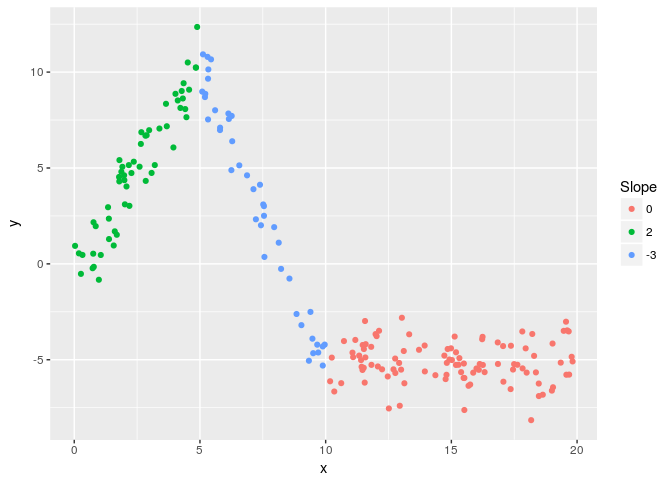

lspline
=======

[](https://travis-ci.org/mbojan/lspline) []() [](http://cranlogs.r-pkg.org/) [](https://cran.r-project.org/package=lspline)

Linear splines with parametrizations such that

-   coefficients are slopes of consecutive segments
-   coefficients capture slope change at consecutive knots

Example
=======

Let us generate some artificial data

``` r
set.seed(666)
n <- 200
d <- data.frame(
  x = runif(n) * 20
)
d$interval <- findInterval(d$x, c(5, 10), rightmost.closed = TRUE) + 1
d$slope <- c(2, -3, 0)[d$interval]
d$intercept <- c(0, 25, -5)[d$interval]
d$y <- with(d, intercept + slope * x + rnorm(n, 0, 1))
```

Plotting `y` against `x`

``` r
library(ggplot2)

ggplot(d, aes(x=x, y=y)) + 
  geom_point(aes(colour=as.character(slope))) +
  scale_color_discrete(name="Slope")
```



We can parametrize the spline with slopes of individual segments (default `marginal=FALSE`):

``` r
library(lspline)
m1 <- lm(y ~ lspline(x, c(5, 10)), data=d)
summary(m1)
## 
## Call:
## lm(formula = y ~ lspline(x, c(5, 10)), data = d)
## 
## Residuals:
##      Min       1Q   Median       3Q      Max 
## -2.98836 -0.74341  0.00943  0.80606  2.36928 
## 
## Coefficients:
##                        Estimate Std. Error t value Pr(>|t|)    
## (Intercept)           -0.562503   0.268264  -2.097   0.0373 *  
## lspline(x, c(5, 10))1  2.185686   0.077773  28.103   <2e-16 ***
## lspline(x, c(5, 10))2 -3.110708   0.056823 -54.744   <2e-16 ***
## lspline(x, c(5, 10))3  0.003326   0.032048   0.104   0.9174    
## ---
## Signif. codes:  0 '***' 0.001 '**' 0.01 '*' 0.05 '.' 0.1 ' ' 1
## 
## Residual standard error: 1.056 on 196 degrees of freedom
## Multiple R-squared:  0.9651, Adjusted R-squared:  0.9645 
## F-statistic:  1804 on 3 and 196 DF,  p-value: < 2.2e-16
```

Or parametrize with coeficients measuring change in slope (with `marginal=TRUE`):

``` r
m2 <- lm(y ~ lspline(x, c(5,10), marginal=TRUE), data=d)
summary(m2)
## 
## Call:
## lm(formula = y ~ lspline(x, c(5, 10), marginal = TRUE), data = d)
## 
## Residuals:
##      Min       1Q   Median       3Q      Max 
## -2.98836 -0.74341  0.00943  0.80606  2.36928 
## 
## Coefficients:
##                                        Estimate Std. Error t value
## (Intercept)                            -0.56250    0.26826  -2.097
## lspline(x, c(5, 10), marginal = TRUE)x  2.18569    0.07777  28.103
## lspline(x, c(5, 10), marginal = TRUE)  -5.29639    0.12134 -43.648
## lspline(x, c(5, 10), marginal = TRUE)   3.11403    0.08034  38.760
##                                        Pr(>|t|)    
## (Intercept)                              0.0373 *  
## lspline(x, c(5, 10), marginal = TRUE)x   <2e-16 ***
## lspline(x, c(5, 10), marginal = TRUE)    <2e-16 ***
## lspline(x, c(5, 10), marginal = TRUE)    <2e-16 ***
## ---
## Signif. codes:  0 '***' 0.001 '**' 0.01 '*' 0.05 '.' 0.1 ' ' 1
## 
## Residual standard error: 1.056 on 196 degrees of freedom
## Multiple R-squared:  0.9651, Adjusted R-squared:  0.9645 
## F-statistic:  1804 on 3 and 196 DF,  p-value: < 2.2e-16
```

The coefficients are

-   `lspline(x, c(5, 10), marginal = TRUE)x` - the slope of the first segment
-   `lspline(x, c(5, 10), marginal = TRUE)` - the change in slope at knot *x* = 5; it is changing from 2 to -3, so by -5
-   `lspline(x, c(5, 10), marginal = TRUE)` - tha change in slope at knot *x* = 10; it is changing from -3 to 0, so by 3

The two parametrizations give obviously identical predicted values

``` r
all.equal( fitted(m1), fitted(m2) )
## [1] TRUE
```

Installation
============

``` r
devtools::install_github("mbojan/lspline")
```

Acknowledgements
================

Inspired by Stata command `mkspline` and function `ares::lspline` from Junger & Ponce de Leon (2011).

-   Junger & Ponce de Leon (2011) *`ares`: Environment air pollution epidemiology: a library for timeseries analysis*. R package version 0.7.2 retrieved from CRAN archives.
